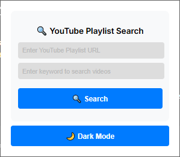
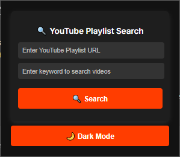

# 🔍 YouTube Playlist Search Extension  

A powerful Chrome extension that lets you **instantly search inside massive YouTube playlists** by keyword.  
Perfect for playlists with **hundreds or even thousands of videos** — no more endless scrolling.  

---

## ✨ Features
- ⚡ **Instant Search** – Find videos in large playlists in seconds.  
- 🎯 **Keyword Highlighting** – Quickly spot results in video titles.  
- 📊 **Live Progress Tracking** – See how many videos have been loaded in real-time.  
- 🎨 **Dark/Light Mode** – Beautiful interface with theme toggle (saves your preference).  
- 🖥 **Auto-detects Playlist** – Automatically fills in the playlist URL if you’re already on a playlist page.  
- 🔑 **No Servers Required** – Runs entirely in your browser.  

---

## 📸 Screenshots

<p align="center">
  
  <span style="display:inline-block; vertical-align:middle; width:10px;">&nbsp;</span>
  
</p>
<p align="center">
  Light Mode &nbsp;&nbsp; | &nbsp;&nbsp; Dark Mode
</p>


---

## 🚀 Setup

1. Clone the repository:
   ```powershell
   git clone https://github.com/nakshatrabhatt/Youtube-Playlist-Search.git
   cd Youtube-Playlist-Search
   ```
2. Open popup.js and add your YouTube Data API v3 Key at the top:
    ```javascript   
    const API_KEY = "YOUR_API_KEY_HERE";
    ```
3. Open Chrome and navigate to:

    [`chrome://extensions/`](chrome://extensions/)

4. Enable Developer Mode. Click Load unpacked and select the project folder.

## 🎬 Usage

- Open any YouTube playlist.

- Click the extension icon.

- The playlist URL will auto-fill (or paste one manually).

- Enter a keyword to search videos by title or description.

- Results will appear instantly with:

    - Thumbnail preview

    - Publish date

    - Keyword highlights

## 🛣 Roadmap

Planned improvements to make this tool even more powerful:

* [ ] Search already loaded videos instantly while new videos are still fetching

* [ ] Allow updating or replacing the playlist without losing previous search results

* [ ] Preserve loaded videos even if the popup is accidentally closed

* [ ] Multi-key API rotation to handle quota limits.

* [ ] Support for searching across entire YouTube channels, not just playlists.

* [ ] Advanced filters (e.g., date range, title only, description only).

* [ ] Export search results to CSV/JSON.

* [ ] Smarter caching for near-instant repeated searches.

* [ ] Sleeker UI animations and transitions.

## 🤝 Contributing

Contributions are welcome!

Feel free to fork the repo, open issues, or submit pull requests.

## 📜 License

This project is licensed under the MIT License.